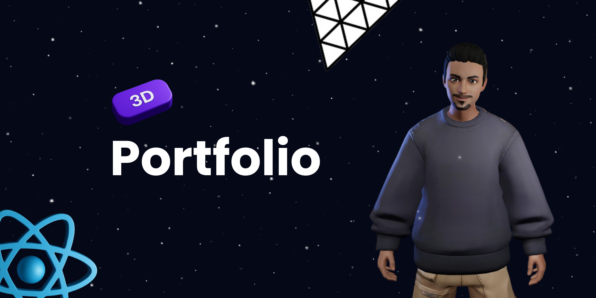

# Portfolio 3D
Ce portfolio réalisé en React et Three.js tout en intégrant des composants de plusieurs plateformes dans le but d'approfondir mes connaissances en React. Afin d'avoir une compréhension approfondi, j'ai suivi quelques tutoriels Youtube notamment ceux de JavaScript Mastery.

  

## Stacks utilisées
* React
* Three.js
* Framer Motion
* Tailwind CSS
* React Three Fiber
* Vite

## Ressources complémentaires:
- [JavaScript Mastery](https://www.youtube.com/@javascriptmastery)
- [CodePen](https://codepen.io/trending)
- [React Bits](https://reactbits.dev/)
- [Ready Player Me](https://readyplayer.me/fr)
- [Mixamo](https://www.mixamo.com/)

# Auteur
**Math-Baba** - [GitHub](https://github.com/Math-Baba)
